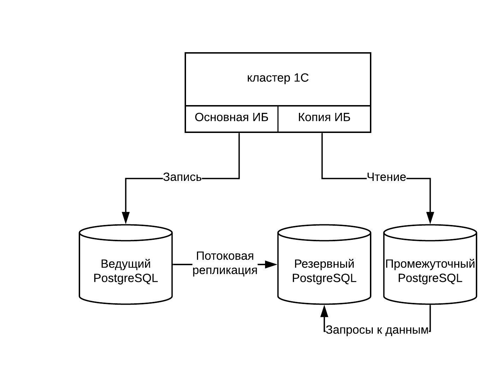

### Реплика информационной базы 1С:Предприятие в PostgreSQL
-------

#### Постановка задачи
Хочется получить возможность запускать 1С:Предприятие на реплике базы данных. Что бы строить отчёты, забирать статистику, выгружать данные не создавая нагрузку на основную СУБД.

#### Схема решения

Для реализации будем использовать расширение для PostgreSQL [postgres-fdw](https://postgrespro.ru/docs/postgresql/11/postgres-fdw). 
Пользователи, которым нужен доступ только на чтение, будут обращаться к отдельной информационной базе в кластере 1С. В настройках информационной базы будет указано, что данные расположены на промежуточном сервере PostgreSQL. В базе, на промежуточном сервере PostgreSQL, вместо таблиц с данными будут ссылки на таблицы в реплике базы на резервном сервере PostgreSQL.
Промежуточный сервер PostgreSQL необходим для решения двух проблем:
 * 1С:Предприятие пишет в служебные таблицы, даже если у пользователя нет прав на запись, включая право на запись настроек.
 * При выполнении многих запросов к СУБД, 1С:Предприятие использует временные таблицы. На резервном сервере PostgreSQL работа с временным таблицами невозможна.



#### Развёртывание решения

Предположим, что у нас уже есть:
 * Кластер 1С, с созданной информационной базой
 * Ведущий сервер PostgreSQL, который обслуживает эту информационную базу
 * Резервный сервер PostgreSQL, на который настроена потоковая репликация

Тогда для организации доступа только на чтение потребуется добавить:
 * промежуточный сервер PostgreSQL
 * новую базу данных в кластере 1С с размещением на промежуточном сервере PostgreSQL

Затем следует настроить созданную базу на PostgreSQL
1. Подключаемся к базе с правами суперпользователя
1. Создаём в базе расширение postgres_fdw
   ```sql
   CREATE EXTENSION postgres_fdw;
   ```
1. Создаём сервер, указывая параметры для подключения к резервному серверу
    ```sql
    CREATE SERVER standby_server FOREIGN DATA WRAPPER postgres_fdw OPTIONS (host 'standby_server_ip', dbname 'base1c', port '5432');
    ```
1. Создаём отображение для пользователей промежуточного сервера
   ```sql
    CREATE USER MAPPING FOR postgres SERVER dbone OPTIONS (user 'usr1cv8', password 'pas1cv8');
    CREATE USER MAPPING FOR usr1cv8 SERVER dbone OPTIONS (user 'usr1cv8', password 'pas1cv8');
    ```
1. Создаём схему, в которую будем отображать системные таблицы 1С:Предприятие
   ```sql
    CREATE SCHEMA v8system;
    ```
1. Отображаем системные таблицы 1С:Предприятие в схему v8system
   ```sql
    IMPORT FOREIGN SCHEMA public LIMIT TO (schemastorage, dbschema, ibversion, config, configsave, params, files, depotfiles, configcas, configcassave, _yearoffset, v8users, _odatasettings, _usersworkhistory, _ckindsopt, _extensionsrestruct, _extensionsrestructngs, _extensionsinfo, _extensionsinfongs, _accopt, _dbcopiessettings, _chrcopt, _dbcopies, _dbcopiestrlogs, _dbcopiestrtables, _dbcopiesupdates, _dbcopiestablesstates, _dbcopiesinitiallast, _dbcopiestrchanges, _dbcopiestrchobj, _systemsettings, _commonsettings, _repsettings, _repvarsettings, _datahistoryversions, _frmdtsettings, _dynlistsettings, _datahistoryqueue0, _datahistorylatestversions, _datahistorymetadata, _datahistorysettings) FROM SERVER standby_server INTO v8system;
    ```
1. Отображаем таблицы с данными в схему public
   ```sql
   IMPORT FOREIGN SCHEMA public EXCEPT (schemastorage, dbschema, ibversion, config, configsave, params, files, depotfiles, configcas, configcassave, _yearoffset, v8users, _odatasettings, _usersworkhistory, _ckindsopt, _extensionsrestruct, _extensionsrestructngs, _extensionsinfo, _extensionsinfongs, _accopt, _dbcopiessettings, _chrcopt, _dbcopies, _dbcopiestrlogs, _dbcopiestrtables, _dbcopiesupdates, _dbcopiestablesstates, _dbcopiesinitiallast, _dbcopiestrchanges, _dbcopiestrchobj, _systemsettings, _commonsettings, _repsettings, _repvarsettings, _datahistoryversions, _frmdtsettings, _dynlistsettings, _datahistoryqueue0, _datahistorylatestversions, _datahistorymetadata, _datahistorysettings) FROM SERVER standby_server INTO public;
   ```
3. Удаляем текущие данные из системных таблиц 1С:Предприятие промежуточной базы данных и заполняем их данными из системных таблиц 1С:Предприятие в реплике

<!-- select 'INSERT INTO "' || tablename || '" SELECT * FROM "v8system.' || tablename || '";' from pg_tables where not tableowner = 'postgres';
 -->

   ```sql
    TRUNCATE schemastorage, dbschema, ibversion, config, configsave, params, files, depotfiles, configcas, configcassave, _yearoffset, v8users, _odatasettings, _usersworkhistory, _ckindsopt, _extensionsrestruct, _extensionsrestructngs, _extensionsinfo, _extensionsinfongs, _accopt, _dbcopiessettings, _chrcopt, _dbcopies, _dbcopiestrlogs, _dbcopiestrtables, _dbcopiesupdates, _dbcopiestablesstates, _dbcopiesinitiallast, _dbcopiestrchanges, _dbcopiestrchobj, _systemsettings, _commonsettings, _repsettings, _repvarsettings, _datahistoryversions, _frmdtsettings, _dynlistsettings, _datahistoryqueue0, _datahistorylatestversions, _datahistorymetadata, _datahistorysettings;
 
    INSERT INTO ibversion SELECT * FROM v8system.ibversion;
    INSERT INTO config SELECT * FROM v8system.config;
    INSERT INTO schemastorage SELECT * FROM v8system.schemastorage;
    INSERT INTO _ckindsopt SELECT * FROM v8system._ckindsopt;
    INSERT INTO _extensionsinfo SELECT * FROM v8system._extensionsinfo;
    INSERT INTO _dbcopiesupdates SELECT * FROM v8system._dbcopiesupdates;
    INSERT INTO _systemsettings SELECT * FROM v8system._systemsettings;
    INSERT INTO dbschema SELECT * FROM v8system.dbschema;
    INSERT INTO configsave SELECT * FROM v8system.configsave;
    INSERT INTO params SELECT * FROM v8system.params;
    INSERT INTO files SELECT * FROM v8system.files;
    INSERT INTO depotfiles SELECT * FROM v8system.depotfiles;
    INSERT INTO configcas SELECT * FROM v8system.configcas;
    INSERT INTO configcassave SELECT * FROM v8system.configcassave;
    INSERT INTO _yearoffset SELECT * FROM v8system._yearoffset;
    INSERT INTO v8users SELECT * FROM v8system.v8users;
    INSERT INTO _odatasettings SELECT * FROM v8system._odatasettings;
    INSERT INTO _usersworkhistory SELECT * FROM v8system._usersworkhistory;
    INSERT INTO _extensionsrestruct SELECT * FROM v8system._extensionsrestruct;
    INSERT INTO _extensionsrestructngs SELECT * FROM v8system._extensionsrestructngs;
    INSERT INTO _extensionsinfongs SELECT * FROM v8system._extensionsinfongs;
    INSERT INTO _accopt SELECT * FROM v8system._accopt;
    INSERT INTO _dbcopiessettings SELECT * FROM v8system._dbcopiessettings;
    INSERT INTO _chrcopt SELECT * FROM v8system._chrcopt;
    INSERT INTO _dbcopies SELECT * FROM v8system._dbcopies;
    INSERT INTO _dbcopiestrlogs SELECT * FROM v8system._dbcopiestrlogs;
    INSERT INTO _dbcopiestrtables SELECT * FROM v8system._dbcopiestrtables;
    INSERT INTO _dbcopiestablesstates SELECT * FROM v8system._dbcopiestablesstates;
    INSERT INTO _dbcopiesinitiallast SELECT * FROM v8system._dbcopiesinitiallast;
    INSERT INTO _dbcopiestrchanges SELECT * FROM v8system._dbcopiestrchanges;
    INSERT INTO _dbcopiestrchobj SELECT * FROM v8system._dbcopiestrchobj;
    INSERT INTO _commonsettings SELECT * FROM v8system._commonsettings;
    INSERT INTO _repsettings SELECT * FROM v8system._repsettings;
    INSERT INTO _repvarsettings SELECT * FROM v8system._repvarsettings;
    INSERT INTO _datahistoryversions SELECT * FROM v8system._datahistoryversions;
    INSERT INTO _frmdtsettings SELECT * FROM v8system._frmdtsettings;
    INSERT INTO _dynlistsettings SELECT * FROM v8system._dynlistsettings;
    INSERT INTO _datahistoryqueue0 SELECT * FROM v8system._datahistoryqueue0;
    INSERT INTO _datahistorylatestversions SELECT * FROM v8system._datahistorylatestversions;
    INSERT INTO _datahistorymetadata SELECT * FROM v8system._datahistorymetadata;
    INSERT INTO _datahistorysettings SELECT * FROM v8system._datahistorysettings;
    ```
 
Всё. Можно открывать 1С:Предприятие и заходить в базу.
Решение проблем с регламентными заданиями и прочим, что может пытаться писать в информационную базу, остаётся в качестве домашнего задания.
 

<!--schemastorage, dbschema, ibversion, config, configsave, params, files, depotfiles, configcas, configcassave, _yearoffset, v8users, _odatasettings, _usersworkhistory, _ckindsopt, _extensionsrestruct, _extensionsrestructngs, _extensionsinfo, _extensionsinfongs, _accopt, _dbcopiessettings, _chrcopt, _dbcopies, _dbcopiestrlogs, _dbcopiestrtables, _dbcopiesupdates, _dbcopiestablesstates, _dbcopiesinitiallast, _dbcopiestrchanges, _dbcopiestrchobj, _systemsettings, _commonsettings, _repsettings, _repvarsettings, _datahistoryversions, _frmdtsettings, _dynlistsettings, _datahistoryqueue0, _datahistorylatestversions, _datahistorymetadata, _datahistorysettings-->


